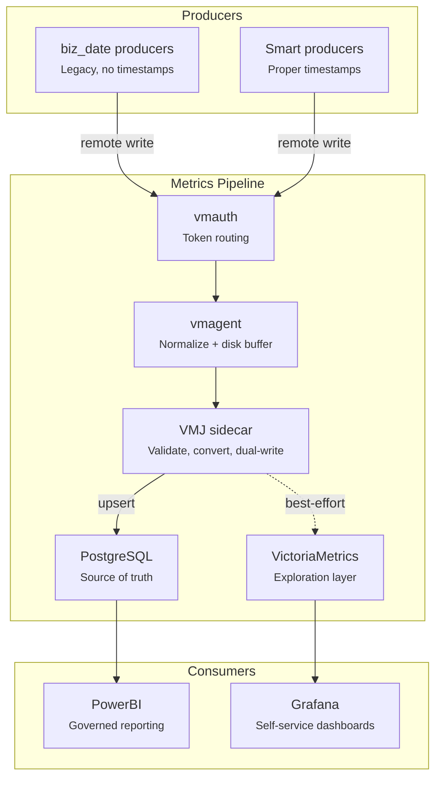
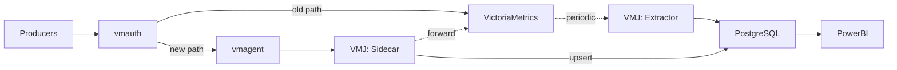
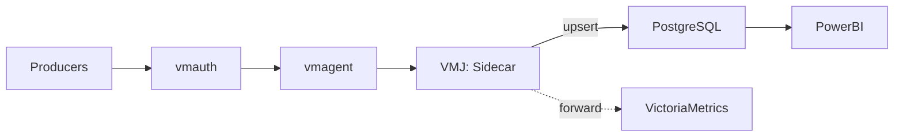
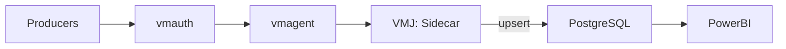

# Capacity Metrics Pipeline — Architecture Summary

## Overview

A metrics pipeline for capacity metrics that ingests daily submissions from internal producers, converts business-date-aware metrics into true timeseries, and serves data through two consumption models: governed reporting (PG + PowerBI) and self-service exploration (VM + Grafana).

## Architecture



## Ingestion Chain

```
producers → vmauth → vmagent → VMJ sidecar → PG + VM
```

- **vmauth** — front door, token-based authentication and routing. Validates bearer tokens and routes known producers to the sidecar. Preserves the multi-protocol ingest commitment as the architectural entry point.
- **vmagent** — protocol normalisation (OTLP, Influx, etc. → Prometheus remote-write). Provides disk-backed buffering: if the sidecar is down, vmagent stages data with original timestamps intact and replays on recovery. In practice all current producers already use remote-write, but vmagent holds this concern architecturally.
- **VMJ sidecar** — the core processing service, implemented as a new mode within the existing VMJ (victoria-metrics-jobs) Python service. The same service that currently runs the periodic extractor jobs will instead run the sidecar. Handles validation, timestamp conversion, and dual-write to PG and VM.

## VMJ Sidecar Responsibilities

A single POST handler per request:

1. Decode Prometheus remote-write (protobuf + snappy)
2. Validate `biz_date` label format
3. Convert `biz_date` + sample timestamp into a manufactured target timestamp (see Timestamp Conversion below)
4. Upsert to PostgreSQL
5. Forward converted metric to VictoriaMetrics (best-effort; VM failure does not fail the request)
6. Return 200

## vmauth Routing & Producer Identity

vmauth routes per bearer token. Each producer has a token, and each token's routing splits writes vs reads: writes go to the sidecar (legacy biz_date path) or directly to VM (smart producer path), while reads always go straight to VM. The sidecar is write-only — no query traffic ever hits it.

Per-token routing uses `url_map` with `src_paths` for path-based splitting:

```yaml
users:
  # Legacy producer — writes to sidecar (biz_date conversion), reads to VM
  - bearer_token: "<producer-a-token>"
    url_map:
      - src_paths:
          - "/api/v1/write"
          - "/api/v1/import.*"
        url_prefix: "http://127.0.0.1:8429/?extra_label=job=producer-a"
      - src_paths:
          - "/api/v1/query.*"
          - "/api/v1/series.*"
          - "/api/v1/labels.*"
          - "/api/v1/label/.*"
        url_prefix: "http://victoria-metrics:8428/?extra_label=job=producer-a"
  
  # Smart producer — both reads and writes direct to VM
  - bearer_token: "<producer-c-token>"
    url_prefix: "http://victoria-metrics:8428/?extra_label=job=producer-c"
  
  # Read-only consumer (Grafana, ad-hoc analyst) — writes blackholed
  - bearer_token: "<team-x-readonly-token>"
    url_map:
      - src_paths:
          - "/api/v1/query.*"
          - "/api/v1/series.*"
          - "/api/v1/labels.*"
          - "/api/v1/label/.*"
        url_prefix: "http://victoria-metrics:8428/?extra_label=job=team-x"
```

Smart producers use a single `url_prefix` since VM handles both read and write paths natively. Read-only tokens omit the write `src_paths` entirely — vmauth returns 404 for unmatched paths.

### `extra_label` for non-bypassable producer identity

`extra_label` is a query argument on the `url_prefix`, processed by VictoriaMetrics components (VM and vmagent) at ingest time. vmauth prevents clients from overriding security-sensitive query args specified in `url_prefix`, so producers cannot spoof their `job` label — vmauth's value always wins.

How the label flows on the write path:

1. **vmauth** appends `?extra_label=job=<producer>` to the request URL forwarded to vmagent
2. **vmagent** consumes the query arg at its `/api/v1/write` endpoint and stamps `job=<producer>` as an actual label on every timeseries in the payload, overriding any `job` label the producer may have sent
3. **Sidecar** receives a normal remote-write payload — `job` is already in the protobuf labels, no query-string parsing needed
4. **Sidecar** uses `job` from the labels as the authoritative producer identity for PG upsert, and forwards the payload (with the label intact) to VM

On the read path, vmauth's `extra_label` reaches VM directly and is applied as an `extra_filter`, scoping query results to that producer's data. The same mechanism delivers row-level security on both write and read sides.

This gives a non-bypassable producer identity tag that flows through the entire pipeline:

- **vmauth** stamps `extra_label=job=<producer>` based on the authenticated token, on both read and write paths
- **vmagent** materialises the query arg into a real label on the timeseries before the sidecar sees it
- **Sidecar** uses `job` from the protobuf labels as the authoritative `job` value for PG upsert (vmagent has already overridden any spoofed value)
- **VM** receives `job` as a real label from the sidecar's forward, no further processing needed
- **PG row-level security** keys on the `job` column for read isolation between consumers
- **VM read-side filtering** scopes query results to the caller's `job` automatically — Grafana/PowerBI users see only their authorised data without dashboard-level filter discipline

End-to-end identity consistency from vmauth through to both PG and VM, enforced at ingest and at query, not by trust in producer-supplied labels.

## Timestamp Conversion

Producers submit metrics with a `biz_date` label and no meaningful timestamp (assigned by vmagent at submission time). The sidecar converts these into true timeseries by mapping the submission timestamp into the millisecond range of the business date's day.

```
submission_window = [biz_date, biz_date + max_staleness]    # e.g. 12 months
offset = (submission_ts - biz_date) / max_staleness
target_ts = biz_date_midnight + offset * 86,400,000ms
```

This ensures:

- Later resubmissions always produce a later target timestamp (monotonicity)
- Each resubmission is a distinct sample in VM (avoids VM's max-value dedup on duplicate timestamps)
- PG resolves last-write-wins via upsert — no extractor or background reconciliation needed
- Producers are fully decoupled from timestamp semantics; they submit `biz_date` + value, the sidecar handles the rest

At 12-month max staleness, resolution is ~1 target ms per 6 minutes of wall-clock time — more than sufficient for daily batch submissions.

## PostgreSQL Schema

Two tables:

- **metrics_metadata** — metric name, label set, `job` (producer identity). Upsert on submission.
- **metrics_data** — metric name, `job`, biz_date, hour, value, submission_ts. Upsert on `(metric, job, biz_date, hour)` — latest value wins, no tracking or comparison logic needed.

Producer identity (`job`) comes from the vmauth-stamped `extra_label` query arg, not from labels in the producer's payload. PG row-level security policies key on the `job` column for read isolation. Token management remains in vmauth configuration.

Invalid submissions (bad `biz_date` format, out-of-range timestamps, missing `extra_label`) are routed to a `metrics_rejected` table for audit.

## Two Producer Paths

vmauth routes producers based on token or path:

- **biz_date producers** → sidecar with timestamp conversion + PG upsert + VM forward
- **Smart producers** (proper timestamps, no `biz_date` label) → sidecar with PG upsert only + passthrough to VM

The smart producer path is the graduation incentive. Over time, producers migrate to proper timestamps and the conversion logic withers.

Both paths can be served by the same Python service on different endpoints.

## Two Consumption Models

- **PG + PowerBI** — governed reporting path. Upserted, deduplicated, business-date-aligned data. Current primary consumer.
- **VM + Grafana** — self-service exploration. Full timeseries available for ad-hoc queries and custom dashboards. Open to any team that wants to bypass the reporting queue.

Same data, different audiences.

## Resilience

- **VM down** — sidecar continues; PG upsert succeeds, VM forward fails silently. No data loss.
- **Sidecar down** — vmagent buffers to disk with original timestamps preserved. On recovery, vmagent replays and sidecar processes with correct timestamps.
- **PG down** — sidecar can reject or buffer locally (log to file + retry). At <1k metrics/day, simple file-based fallback is sufficient.

## Error Handling

A remote-write batch can contain multiple timeseries. The sidecar processes each independently — a bad metric does not fail the entire batch.

Partial rejections (invalid `biz_date` format, missing required labels) are silently accepted from the producer's perspective (HTTP 200) and routed to a `metrics_rejected` table for audit. The producer does not retry — they would just resend the same bad data.

Infrastructure failures (PG down, sidecar bug) return HTTP 5xx. vmagent treats this as a transient failure, keeps the batch in its disk buffer, and retries with backoff. This is the primary resilience mechanism.

| Scenario | HTTP Response | Retry? | Data Destination |
|---|---|---|---|
| All metrics valid | 200 | No | metrics_data + VM |
| Some invalid labels/format | 200 | No | valid → metrics_data + VM, invalid → metrics_rejected |
| PG down | 5xx | vmagent retries | vmagent disk buffer |
| VM down | 200 | No | metrics_data (PG has the data, VM forward is best-effort) |
| Sidecar crash/bug | 5xx | vmagent retries | vmagent disk buffer |

## What This Eliminates

- No biz_date-encoded metrics in VM — all metrics are true timeseries
- No background converter feed, no deletion of unconverted metrics
- No extractor jobs from VM to PG — VMJ evolves from running periodic extractors to running the sidecar; direct upsert replaces the entire extraction pipeline
- vmauth, vmagent, VM remain but carry reduced operational burden

## Phased Rollout

- **Phase 1a** — Deploy sidecar and add a new route in vmauth pointing to it. Both the old path (producers → vmauth → VM direct) and the new path (producers → vmauth → vmagent → sidecar → PG + VM) run in parallel. Select a subset of producers to route through the sidecar for validation. Old path continues unchanged — no risk to existing data flow.
- **Phase 1b** — Once sidecar is proven, migrate historical data on the database side and switch all remaining producers to the new sidecar route in vmauth. Old direct-to-VM path retired. Extractor and converter jobs decommissioned. PG is now the source of truth; VM continues to receive converted metrics via sidecar forward.
- **Phase 2** — Once VM is no longer needed, stop the VM process and disable the forward in the sidecar config. Sidecar writes to PG only. vmauth and vmagent remain in place — they continue to provide token-based routing, multi-protocol normalisation, and disk-buffered resilience for the sidecar. The architectural story stays intact: the ingestion stack still supports multi-protocol ingest, it simply no longer has a VM backend. Reactivating VM later is a config change, not a rebuild.
- **Phase 3** — Optionally absorb vmauth token validation into the sidecar. Reduces to two services (vmagent + proxy) while preserving buffering. Full collapse to a single service is possible only if vmagent's disk buffer is replicated in the proxy itself.

Each phase is independently shippable with no big-bang migration.

### Current state


### Phase 1a — parallel paths



### Phase 1b — sidecar only, extractor retired



### Phase 2 — VM stopped


