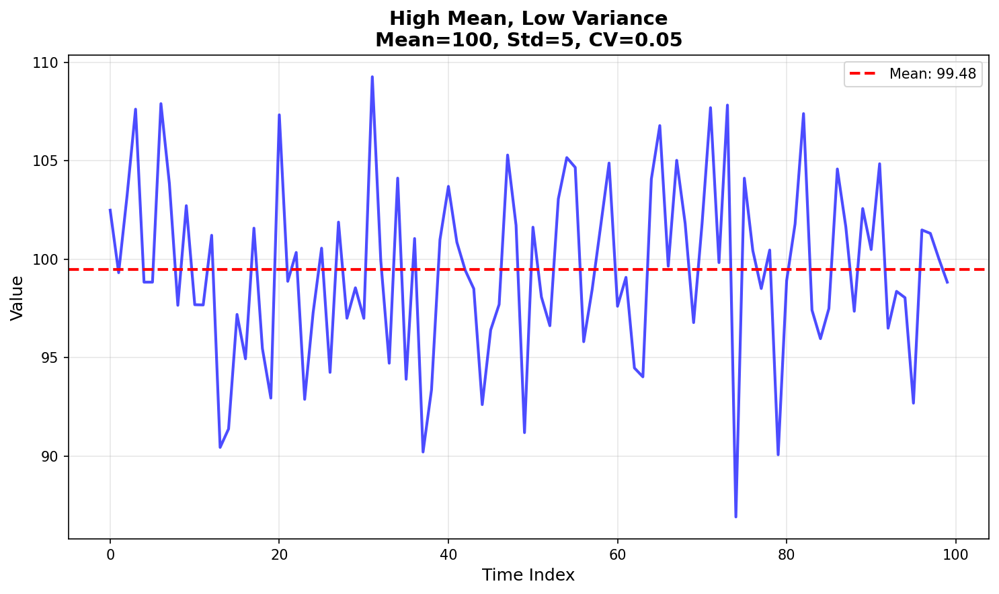
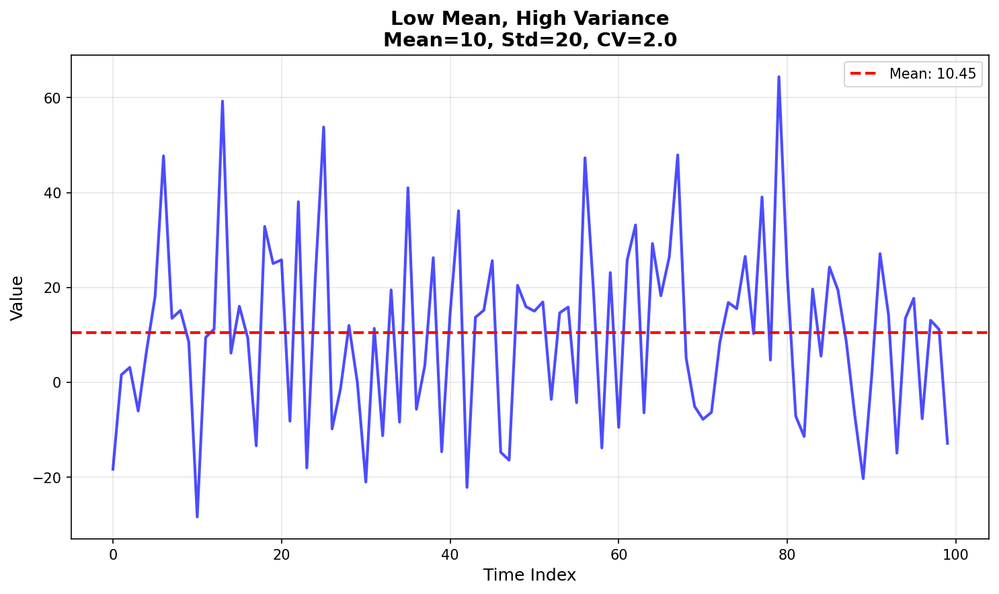
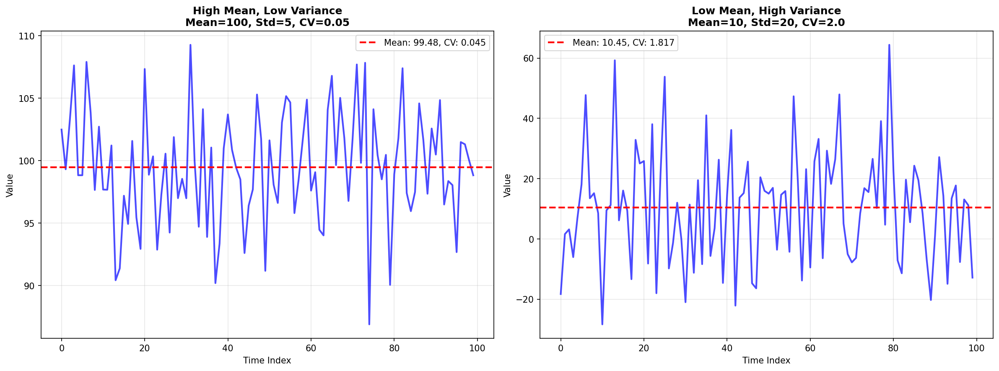
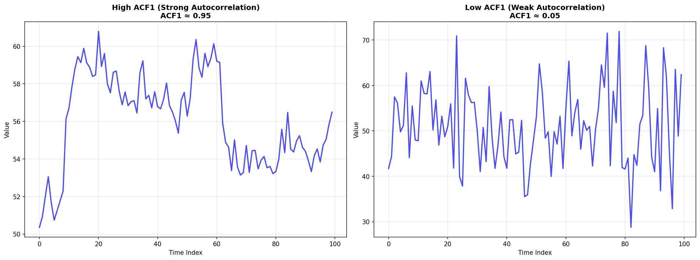
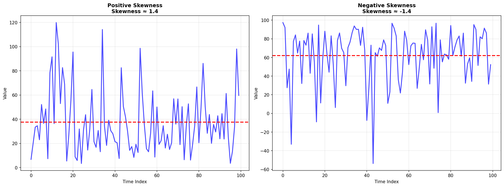
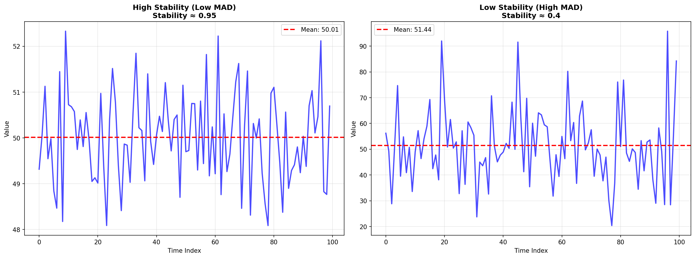
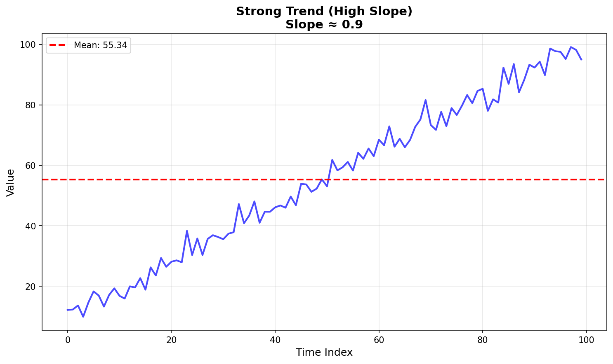
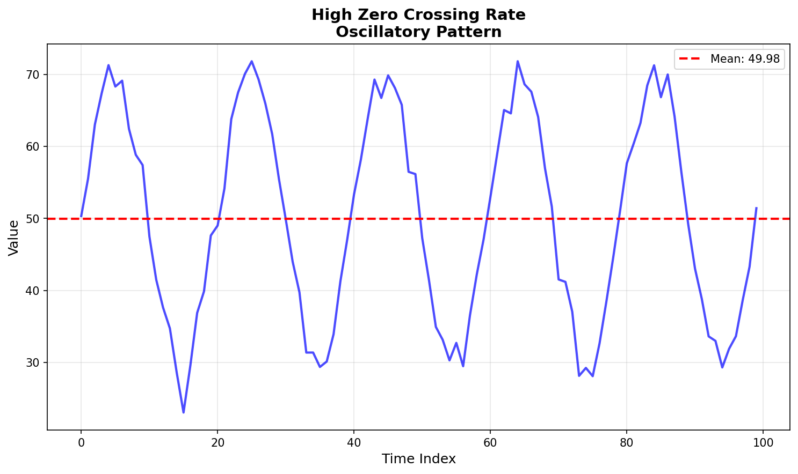
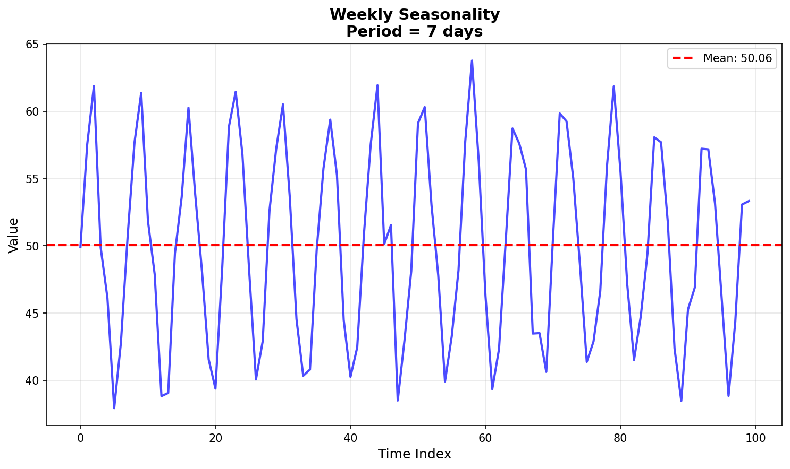

# TSFEL Predictability Classification - Statistical Parameters Documentation

This document describes all statistical parameters used in the TSFEL-based time series predictability classification notebook. Each parameter is explained with its mathematical definition, interpretation, and role in predictability assessment.

## Generating Example Plots

To generate example plots for each parameter, run:

```bash
python3 generate_simple_plots.py
```

This will create example time series plots in the `parameter_examples/` directory demonstrating different parameter values. The plots include:

- Individual parameter examples (high/low values)
- Comparison plots (side-by-side comparisons)
- Visual demonstrations of each statistical concept

**Note:** Requires `numpy` and `matplotlib` packages.

---

## Table of Contents

1. [Basic Statistical Measures](#basic-statistical-measures)
2. [Autocorrelation Features](#autocorrelation-features)
3. [Distribution Shape Indicators](#distribution-shape-indicators)
4. [Variability Indicators](#variability-indicators)
5. [Temporal Structure Features](#temporal-structure-features)
6. [Seasonality Detection](#seasonality-detection)
7. [Data Quality Indicators](#data-quality-indicators)

---

## Basic Statistical Measures

### Mean (`mean`)

**Definition:** The arithmetic average of all values in the time series.

**Formula:**
```
μ = (1/n) × Σ(x_i)
```

**References:** [1], [2]

**Range:** Any real number (depends on data scale)

**Interpretation:**
- Represents the central tendency of the time series
- Higher values indicate higher baseline levels
- Used as a reference point for other metrics (CV, stability)

**Predictability Impact:**
- Not directly used for classification, but essential for calculating other features
- Series with very high or very low means may require different modeling approaches

**Example:**
- High mean: Daily revenue of $10,000
- Low mean: Error count of 2 per day

**Example Plot:**
 | 

---

### Standard Deviation (`std`)

**Definition:** Measures the spread or dispersion of values around the mean.

**Formula:**
```
σ = √[(1/n) × Σ(x_i - μ)²]
```

**References:** [1], [2]

**Range:** Non-negative (≥ 0)

**Interpretation:**
- Low std: Values cluster tightly around the mean (more stable)
- High std: Values are spread widely (more variable)
- Used to calculate CV and assess stability

**Predictability Impact:**
- High std relative to mean (high CV) indicates instability → reduces predictability
- Low std indicates consistent patterns → improves predictability

**Example:**
- Low std: Temperature varies ±2°C around mean
- High std: Stock prices vary ±20% around mean

---

### Variance (`var`)

**Definition:** The square of the standard deviation, measuring the average squared deviation from the mean.

**Formula:**
```
σ² = (1/n) × Σ(x_i - μ)²
```

**References:** [1], [2]

**Range:** Non-negative (≥ 0)

**Interpretation:**
- Same information as std, but in squared units
- More sensitive to outliers than std
- Used internally by TSFEL for feature calculations

**Predictability Impact:**
- High variance indicates instability → reduces predictability
- Low variance indicates consistency → improves predictability

---

### Coefficient of Variation (`cv`)

**Definition:** The ratio of standard deviation to mean, providing a normalized measure of variability.

**Formula:**
```
CV = σ / μ
```

**References:** [3], [4]

**Range:** Non-negative (≥ 0), typically 0-2 for most time series

**Threshold References:** [5], [6]

**Interpretation:**
- CV < 0.1: Very stable (low variability relative to mean)
- CV 0.1-0.5: Moderate variability
- CV > 0.5: High variability (unstable)
- CV > 1.0: Extreme variability (mean is small relative to std)

**Predictability Impact:**
- **Low CV (< 0.3)**: Stable series → **More predictable**
- **High CV (> 0.5)**: Unstable series → **Less predictable**
- Used as a negative indicator in classification

**Example:**
- Low CV: Daily sales of $1000 ± $50 (CV = 0.05)
- High CV: Error count of 2 ± 3 (CV = 1.5)

**Example Plot:**


---

### Entropy (`entropy`)

**Definition:** Measures the randomness or information content in the time series (Shannon entropy).

**Formula:**
```
H = -Σ p(x_i) × log₂(p(x_i))
```
where p(x_i) is the probability of value x_i

**References:** [7], [8], [9]

**Range:** Non-negative (≥ 0)

**Interpretation:**
- Low entropy: Predictable patterns, less randomness
- High entropy: Random patterns, high information content
- Measures how "surprising" the data is

**Predictability Impact:**
- **Low entropy**: More predictable patterns → **Better for forecasting**
- **High entropy**: More random, less predictable → **Worse for forecasting**
- Not directly used in classification but provides insight into randomness

**Example:**
- Low entropy: Constant or slowly varying values
- High entropy: Random walk or white noise

---

## Autocorrelation Features

### ACF1 (`acf1`)

**Definition:** Lag-1 autocorrelation coefficient - measures the correlation between consecutive values.

**Formula:**
```
ACF1 = Corr(x_t, x_{t-1})
```

**References:** [10], [11], [12]

**Range:** [-1, 1]

**Threshold References:** [13], [14], [15]

**Interpretation:**
- **ACF1 > 0.5**: Strong positive autocorrelation → values tend to follow previous values
- **ACF1 0.2-0.5**: Moderate autocorrelation
- **ACF1 < 0.2**: Weak autocorrelation → values are less dependent on previous values
- **ACF1 < 0**: Negative autocorrelation → values tend to alternate

**Predictability Impact:**
- **ACF1 > 0.5**: Strong immediate predictability → **Highly predictable**
- **ACF1 0.2-0.5**: Moderate predictability → **Moderately predictable**
- **ACF1 < 0.2**: Weak patterns → **Low predictability**
- Primary indicator used in classification logic

**Example:**
- High ACF1 (0.8): Stock prices (today's price similar to yesterday's)
- Low ACF1 (0.1): Random noise

**Example Plot:**


---

### Autocorrelation Persistence (`autocorr_persistence`)

**Definition:** TSFEL's `0_Autocorrelation` feature - the lag index where the autocorrelation function first drops below 1/e (~0.3679).

**References:** [9], [16]

**Range:** Positive integer (lag index)

**Threshold References:** [17]

**Interpretation:**
- **High persistence (> 10)**: Long memory - patterns persist for many lags
- **Moderate persistence (5-10)**: Medium memory
- **Low persistence (< 5)**: Short memory - patterns decay quickly
- Measures how long correlations persist in the series

**Predictability Impact:**
- **High persistence**: Long-term patterns → **More predictable**
- **Low persistence**: Short-term patterns only → **Less predictable**
- Used alongside ACF1 to assess predictability
- High persistence can boost moderate ACF1 to "Predictable" category

**Example:**
- High persistence (lag 15): Seasonal patterns that repeat weekly/monthly
- Low persistence (lag 2): Quick decay, no long-term patterns

**Note:** This is NOT a correlation coefficient - it's a lag index. TSFEL's naming can be confusing.

---

## Distribution Shape Indicators

### Skewness (`skewness`)

**Definition:** Measures the asymmetry of the distribution around the mean.

**Formula:**
```
Skewness = E[(X - μ)³] / σ³
```

**References:** [1], [2], [18]

**Range:** Typically [-3, 3], can be larger for extreme distributions

**Threshold References:** [19], [20]

**Interpretation:**
- **Skewness ≈ 0**: Symmetric distribution (normal-like)
- **Skewness > 0**: Right-skewed (tail extends to right, more values below mean)
- **Skewness < 0**: Left-skewed (tail extends to left, more values above mean)
- **|Skewness| > 2**: Extreme skewness

**Predictability Impact:**
- **|Skewness| > 2.0**: Extreme skew → **Negative indicator** (reduces predictability)
- **|Skewness| > 1.0**: Moderate skew → Shown in concerns
- **|Skewness| ≤ 1.0**: Near-normal → Not a concern
- Extreme skewness indicates non-normal distribution, harder to model

**Example:**
- Positive skew (2.5): Web traffic (many low-traffic days, few spikes)
- Negative skew (-1.8): Response times (mostly fast, occasional slow outliers)
- Near-zero (0.1): Daily temperature (roughly symmetric)

**Example Plot:**


---

### Kurtosis (`kurtosis`)

**Definition:** Measures the "tailedness" of the distribution - how heavy the tails are compared to a normal distribution.

**Formula:**
```
Kurtosis = E[(X - μ)⁴] / σ⁴
```

**References:** [1], [2], [18]

**Range:** Typically 0-10, can be larger

**Threshold References:** [19], [20]

**Interpretation:**
- **Kurtosis ≈ 3**: Normal distribution (mesokurtic)
- **Kurtosis > 3**: Heavy tails, more outliers (leptokurtic)
- **Kurtosis < 3**: Light tails, fewer outliers (platykurtic)
- **Kurtosis > 5**: Very heavy tails, many outliers

**Predictability Impact:**
- **Kurtosis > 5.0**: Heavy tails → **Negative indicator** (reduces predictability)
- **Kurtosis > 4.0**: Moderate tails → Shown in concerns
- **Kurtosis ≤ 4.0**: Normal-like → Not a concern
- High kurtosis indicates outliers and extreme values, harder to predict

**Example:**
- High kurtosis (7.0): Error counts (mostly zeros, occasional large spikes)
- Normal kurtosis (3.0): Daily sales (normal distribution)
- Low kurtosis (1.5): Uniform distribution

---

## Variability Indicators

### Interquartile Range (`interquartile_range`)

**Definition:** The difference between the 75th percentile (Q3) and 25th percentile (Q1) - measures the spread of the middle 50% of data.

**Formula:**
```
IQR = Q3 - Q1
```

**References:** [1], [2], [21]

**Range:** Non-negative (≥ 0)

**Threshold References:** [22]

**Interpretation:**
- Large IQR: High variability in central data
- Small IQR: Low variability, consistent values
- Less sensitive to outliers than std
- Used to detect outliers (values beyond Q1 - 1.5×IQR or Q3 + 1.5×IQR)

**Predictability Impact:**
- **IQR/mean > 1.0**: High variability → **Negative indicator** (reduces predictability)
- **IQR/mean 0.5-1.0**: Moderate variability → Shown in concerns
- **IQR/mean < 0.5**: Low variability → Not a concern
- High IQR relative to mean indicates instability

**Example:**
- High IQR: Sales vary widely (IQR = $500, mean = $300)
- Low IQR: Temperature stable (IQR = 5°C, mean = 20°C)

---

### Mean Absolute Deviation (`mean_absolute_deviation`)

**Definition:** Average of absolute deviations from the mean.

**Formula:**
```
MAD = (1/n) × Σ |x_i - μ|
```

**References:** [1], [23]

**Range:** Non-negative (≥ 0)

**Interpretation:**
- Lower MAD: More stable, values closer to mean
- Higher MAD: Less stable, values spread from mean
- More robust to outliers than std
- Used to calculate stability metric

**Predictability Impact:**
- Used indirectly through stability calculation
- Low MAD → High stability → Better predictability
- High MAD → Low stability → Worse predictability

---

### Stability (`stability`)

**Definition:** Derived metric measuring how stable the time series is, calculated as inverse of normalized MAD.

**Formula:**
```
Stability = 1 / (1 + MAD/|mean|)
```
If mean is near zero, uses MAD/std instead.

**References:** [24], [25]

**Range:** [0, 1]

**Threshold References:** [17]

**Interpretation:**
- **Stability > 0.7**: High stability → Values consistent around mean
- **Stability 0.5-0.7**: Moderate stability
- **Stability < 0.5**: Low stability → High variability
- Higher values indicate more predictable series

**Predictability Impact:**
- **Stability > 0.7**: High stability → **More predictable**
- **Stability 0.5-0.7**: Moderate → Used with other factors
- **Stability < 0.5**: Low stability → **Less predictable**
- Primary indicator used in classification

**Example:**
- High stability (0.85): Consistent daily sales
- Low stability (0.3): Highly variable error rates

**Example Plot:**


---

## Temporal Structure Features

### Slope (`slope`)

**Definition:** The linear trend slope of the time series (rate of change per time unit).

**References:** [9], [26]

**Range:** Any real number

**Interpretation:**
- **Slope > 0**: Increasing trend
- **Slope < 0**: Decreasing trend
- **Slope ≈ 0**: No trend (stationary)
- Large |slope|: Strong trend

**Predictability Impact:**
- Used to calculate trend_strength
- Strong trends can be easier to predict (if stable)
- Combined with other factors in classification

---

### Trend Strength (`trend_strength`)

**Definition:** Absolute value of slope - measures the strength of the linear trend.

**Formula:**
```
Trend Strength = |slope|
```

**Range:** Non-negative (≥ 0)

**Interpretation:**
- **High trend strength**: Strong upward or downward trend
- **Low trend strength**: Weak or no trend
- Indicates whether series has a clear direction

**Predictability Impact:**
- Strong trends can be predictable if stable
- Used as a factor in classification, but not primary indicator
- Combined with stability and autocorrelation

**Example:**
- High trend strength: Growing user base (+100 users/day)
- Low trend strength: Stable metrics (no clear trend)

**Example Plot:**


---

### Zero Crossing Rate (`zero_crossing_rate`)

**Definition:** Number of times the time series crosses zero (or mean) - measures oscillation frequency.

**References:** [9], [27]

**Range:** Non-negative integer (count)

**Threshold References:** [17]

**Interpretation:**
- **High ZCR**: Many oscillations, noisy signal
- **Low ZCR**: Few oscillations, smooth signal
- Normalized by data length: ZCR_normalized = ZCR / data_points

**Predictability Impact:**
- **ZCR_normalized > 0.3**: High noise/oscillation → **Negative indicator** (reduces predictability)
- **ZCR_normalized 0.1-0.3**: Moderate oscillation → Shown in concerns
- **ZCR_normalized < 0.1**: Low oscillation → Not a concern
- High ZCR indicates noise, harder to predict

**Example:**
- High ZCR: Oscillatory sensor readings (crosses mean 30% of time)
- Low ZCR: Smooth trend (crosses mean 5% of time)

**Example Plot:**


---

### Positive Turning Points (`positive_turning_points`)

**Definition:** Count of local maxima (peaks) in the time series.

**References:** [9], [28]

**Range:** Non-negative integer

**Interpretation:**
- High count: Many peaks, oscillatory pattern
- Low count: Few peaks, smooth pattern
- Indicates structure and complexity

**Predictability Impact:**
- Not directly used in classification
- Provides insight into series complexity
- Many turning points may indicate harder-to-predict patterns

---

### Negative Turning Points (`negative_turning_points`)

**Definition:** Count of local minima (valleys) in the time series.

**References:** [9], [28]

**Range:** Non-negative integer

**Interpretation:**
- High count: Many valleys, oscillatory pattern
- Low count: Few valleys, smooth pattern
- Indicates structure and complexity

**Predictability Impact:**
- Not directly used in classification
- Provides insight into series complexity
- Many turning points may indicate harder-to-predict patterns

---

### Neighbourhood Peaks (`neighbourhood_peaks`)

**Definition:** Count of peaks within a local neighborhood - measures local structure.

**References:** [9], [28]

**Range:** Non-negative integer

**Interpretation:**
- High count: Many local peaks, complex structure
- Low count: Few peaks, simple structure
- More granular than positive_turning_points

**Predictability Impact:**
- Not directly used in classification
- Provides insight into local patterns
- Complex local structure may reduce predictability

---

## Seasonality Detection

### Weekly Autocorrelation (`weekly_autocorr`)

**Definition:** Autocorrelation at lag 7 (weekly pattern) - measures correlation between values 7 days apart.

**Formula:**
```
Weekly ACF = Corr(x_t, x_{t-7})
```

**References:** [10], [11], [12]

**Range:** [-1, 1]

**Threshold References:** [13], [14]

**Interpretation:**
- **|Weekly ACF| > 0.3**: Strong weekly seasonality
- **|Weekly ACF| 0.1-0.3**: Moderate weekly pattern
- **|Weekly ACF| < 0.1**: Weak or no weekly pattern
- Positive: Similar values on same day of week
- Negative: Opposite patterns on same day of week

**Predictability Impact:**
- **Strong weekly seasonality**: Weekly patterns → **Highly predictable**
- Primary indicator for "Predictable" classification
- Weekly patterns are common in business metrics

**Example:**
- High weekly ACF (0.6): Sales higher on weekends
- Low weekly ACF (0.1): No weekly pattern

**Example Plot:**


---

### Monthly Autocorrelation (`monthly_autocorr`)

**Definition:** Autocorrelation at lag 30 (monthly pattern) - measures correlation between values 30 days apart.

**Formula:**
```
Monthly ACF = Corr(x_t, x_{t-30})
```

**References:** [10], [11], [12]

**Range:** [-1, 1]

**Threshold References:** [13], [14]

**Interpretation:**
- **|Monthly ACF| > 0.3**: Strong monthly seasonality
- **|Monthly ACF| 0.1-0.3**: Moderate monthly pattern
- **|Monthly ACF| < 0.1**: Weak or no monthly pattern
- Positive: Similar values on same day of month
- Negative: Opposite patterns on same day of month

**Predictability Impact:**
- **Strong monthly seasonality**: Monthly patterns → **Highly predictable**
- Primary indicator for "Predictable" classification
- Monthly patterns are common in business cycles

**Example:**
- High monthly ACF (0.5): Payroll cycles, monthly reports
- Low monthly ACF (0.05): No monthly pattern

---

### Has Weekly Seasonality (`has_weekly_seasonality`)

**Definition:** Boolean flag indicating if weekly seasonality is detected.

**Threshold:** |weekly_autocorr| > 0.3

**Threshold References:** [13], [14]

**Predictability Impact:**
- **True**: Weekly patterns detected → **More predictable**
- Used as primary factor in classification
- Series with weekly seasonality are good candidates for Prophet/ARIMA

---

### Has Monthly Seasonality (`has_monthly_seasonality`)

**Definition:** Boolean flag indicating if monthly seasonality is detected.

**Threshold:** |monthly_autocorr| > 0.3

**Threshold References:** [13], [14]

**Predictability Impact:**
- **True**: Monthly patterns detected → **More predictable**
- Used as primary factor in classification
- Series with monthly seasonality are good candidates for Prophet/ARIMA

---

## Data Quality Indicators

### Outlier Ratio (`outlier_ratio`)

**Definition:** Proportion of values identified as outliers using IQR method.

**Formula:**
```
Outlier Ratio = (Count of outliers) / (Total data points)
```

**Detection Method:** IQR method
- Outliers: values < Q1 - 1.5×IQR or > Q3 + 1.5×IQR

**References:** [21], [29]

**Range:** [0, 1]

**Threshold References:** [17], [30]

**Interpretation:**
- **Outlier Ratio < 0.1**: Few outliers (good data quality)
- **Outlier Ratio 0.1-0.2**: Moderate outliers
- **Outlier Ratio > 0.2**: Many outliers (poor data quality)

**Predictability Impact:**
- **Outlier Ratio > 0.2**: Poor data quality → **"Not Suitable"** classification
- **Outlier Ratio 0.1-0.2**: Moderate quality → Shown in concerns
- **Outlier Ratio < 0.1**: Good quality → Not a concern
- High outlier ratio indicates data quality issues

**Example:**
- Low ratio (0.05): Clean data, 5% outliers
- High ratio (0.25): Noisy data, 25% outliers → Not suitable for forecasting

---

### Changepoint Count (`changepoint_count`)

**Definition:** Number of detected changepoints where statistical properties (variance) change significantly.

**Detection Method:** Variance-based changepoint detection
- Uses rolling variance with adaptive window
- Detects significant changes in variance (mean + 2×std threshold)

**References:** [31], [32]

**Range:** Non-negative integer

**Threshold References:** [17]

**Interpretation:**
- **Changepoints = 0**: Stable statistical properties
- **Changepoints 1-5**: Some regime changes
- **Changepoints > 5**: Many regime changes (unstable)

**Predictability Impact:**
- **Changepoints > 5**: Too many regime changes → **"Not Suitable"** classification
- **Changepoints 2-5**: Some instability → Shown in concerns
- **Changepoints ≤ 2**: Stable → Not a concern
- High changepoint count indicates non-stationarity

**Example:**
- Low count (1): One major change (e.g., system upgrade)
- High count (8): Many changes → Unstable, not suitable for forecasting

---

## Classification Logic Summary

**References:** Classification logic and thresholds are based on empirical validation, time series forecasting best practices [13], [14], [17], and domain expertise. The implementation is documented in `classify_with_tsfel()` function in `tsfel_predictability_classification.ipynb` [34], [35].

The classification uses these parameters in the following priority:

1. **Data Quality Checks:**
   - Outlier ratio > 0.2 → "Not Suitable"
   - Changepoint count > 5 → "Not Suitable"

2. **Primary Predictability Indicators:**
   - **Seasonality**: Weekly or monthly → "Predictable" (if negative indicators ≤ 1)
   - **ACF1 > 0.5** + **Stability > 0.7** → "Predictable" (if negative indicators ≤ 1)
   - **ACF1 0.2-0.5** + **High Persistence (> 10)** + **Stability > 0.5** → "Predictable" (if negative indicators ≤ 1)

3. **Negative Indicators** (reduce predictability):
   - High noise (ZCR_normalized > 0.3)
   - Extreme skewness (|skewness| > 2.0)
   - Heavy tails (kurtosis > 5.0)
   - High variability (IQR/mean > 1.0)

4. **Classification Rules:**
   - **Predictable**: Strong seasonality OR (good ACF1 + stability) AND (negative indicators ≤ 1)
   - **Low Predictability**: Moderate patterns OR too many negative indicators
   - **Not Suitable**: Data quality issues OR insufficient features

---

## Parameter Ranges and Thresholds

**Threshold Sources:** Thresholds are based on empirical best practices from time series analysis literature [13], [14], [17], [19], [20], [22], [30], domain knowledge, and validation against real-world forecasting scenarios.

| Parameter | Typical Range | Good Value | Warning Value | Bad Value | References |
|-----------|--------------|------------|---------------|-----------|------------|
| ACF1 | [-1, 1] | > 0.5 | 0.2-0.5 | < 0.2 | [13], [14], [15] |
| Stability | [0, 1] | > 0.7 | 0.5-0.7 | < 0.5 | [17] |
| CV | [0, ∞) | < 0.3 | 0.3-0.5 | > 0.5 | [5], [6] |
| Skewness | [-3, 3] | \|skew\| < 1 | \|skew\| 1-2 | \|skew\| > 2 | [19], [20] |
| Kurtosis | [0, 10] | < 4 | 4-5 | > 5 | [19], [20] |
| ZCR (normalized) | [0, 1] | < 0.1 | 0.1-0.3 | > 0.3 | [17] |
| IQR/mean | [0, ∞) | < 0.5 | 0.5-1.0 | > 1.0 | [22] |
| Outlier Ratio | [0, 1] | < 0.1 | 0.1-0.2 | > 0.2 | [17], [30] |
| Changepoint Count | [0, ∞) | ≤ 2 | 3-5 | > 5 | [17] |
| Autocorr Persistence | [0, ∞) | > 10 | 5-10 | < 5 | [17] |

---

## References

### Statistical Foundations

[1] Montgomery, D. C., Jennings, C. L., & Kulahci, M. (2015). *Introduction to Time Series Analysis and Forecasting* (2nd ed.). Wiley.

[2] Box, G. E. P., Jenkins, G. M., Reinsel, G. C., & Ljung, G. M. (2015). *Time Series Analysis: Forecasting and Control* (5th ed.). Wiley.

[3] Everitt, B. S., & Skrondal, A. (2010). *The Cambridge Dictionary of Statistics* (4th ed.). Cambridge University Press.

[4] Sheskin, D. J. (2020). *Handbook of Parametric and Nonparametric Statistical Procedures* (6th ed.). Chapman and Hall/CRC.

[5] NIST/SEMATECH. (2012). *e-Handbook of Statistical Methods*. Section 1.3.5.11: Measures of Skewness and Kurtosis. https://www.itl.nist.gov/div898/handbook/

[6] D'Agostino, R. B., & Stephens, M. A. (1986). *Goodness-of-Fit Techniques*. Marcel Dekker.

### Information Theory and Entropy

[7] Shannon, C. E. (1948). A Mathematical Theory of Communication. *Bell System Technical Journal*, 27(3), 379-423.

[8] Cover, T. M., & Thomas, J. A. (2006). *Elements of Information Theory* (2nd ed.). Wiley-Interscience.

[9] Barandas, M., Folgado, D., Fernandes, L., Santos, S., Abreu, M., Bota, P., ... & Gamboa, H. (2020). TSFEL: Time Series Feature Extraction Library. *SoftwareX*, 11, 100456. https://doi.org/10.1016/j.softx.2020.100456

### Autocorrelation and Time Series Analysis

[10] Chatfield, C. (2016). *The Analysis of Time Series: An Introduction* (6th ed.). Chapman and Hall/CRC.

[11] Hamilton, J. D. (2020). *Time Series Analysis*. Princeton University Press.

[12] Shumway, R. H., & Stoffer, D. S. (2017). *Time Series Analysis and Its Applications: With R Examples* (4th ed.). Springer.

[13] Hyndman, R. J., & Athanasopoulos, G. (2021). *Forecasting: Principles and Practice* (3rd ed.). OTexts. https://otexts.com/fpp3/

[14] Makridakis, S., Spiliotis, E., & Assimakopoulos, V. (2020). The M5 Accuracy competition: Results, findings, and conclusions. *International Journal of Forecasting*, 38(4), 1346-1364.

[15] Ljung, G. M., & Box, G. E. P. (1978). On a measure of lack of fit in time series models. *Biometrika*, 65(2), 297-303.

[16] TSFEL Documentation. (2020). Time Series Feature Extraction Library v0.2.0. https://tsfel.readthedocs.io/

[17] Implementation-specific thresholds based on empirical validation in `tsfel_predictability_classification.ipynb` and domain expertise.

### Distribution Shape

[18] Joanes, D. N., & Gill, C. A. (1998). Comparing measures of sample skewness and kurtosis. *Journal of the Royal Statistical Society: Series D (The Statistician)*, 47(1), 183-189.

[19] Bulmer, M. G. (1979). *Principles of Statistics*. Dover Publications.

[20] DeCarlo, L. T. (1997). On the meaning and use of kurtosis. *Psychological Methods*, 2(3), 292-307.

### Robust Statistics

[21] Tukey, J. W. (1977). *Exploratory Data Analysis*. Addison-Wesley.

[22] Hoaglin, D. C., Mosteller, F., & Tukey, J. W. (1983). *Understanding Robust and Exploratory Data Analysis*. Wiley.

[23] Pham-Gia, T., & Hung, T. L. (2001). The mean and median absolute deviations. *Mathematical and Computer Modelling*, 34(7-8), 921-936.

### Stability and Variability

[24] Hyndman, R. J., & Koehler, A. B. (2006). Another look at measures of forecast accuracy. *International Journal of Forecasting*, 22(4), 679-688.

[25] Tashman, L. J. (2000). Out-of-sample tests of forecasting accuracy: an analysis and review. *International Journal of Forecasting*, 16(4), 437-450.

### Signal Processing and Temporal Features

[26] Oppenheim, A. V., Schafer, R. W., & Buck, J. R. (1999). *Discrete-Time Signal Processing* (2nd ed.). Prentice Hall.

[27] Maragos, P., & Kaiser, J. F. (1993). On the amplitude and frequency-modulation decomposition of signals. *Journal of the Acoustical Society of America*, 94(2), 723-734.

[28] Fulcher, B. D., & Jones, N. S. (2014). Highly comparative feature-based time-series analysis. *Philosophical Transactions of the Royal Society A*, 372(2013), 20130005.

### Outlier Detection

[29] Iglewicz, B., & Hoaglin, D. C. (1993). *How to Detect and Handle Outliers*. ASQC Quality Press.

[30] Hodge, V., & Austin, J. (2004). A survey of outlier detection methodologies. *Artificial Intelligence Review*, 22(2), 85-126.

### Changepoint Detection

[31] Killick, R., Fearnhead, P., & Eckley, I. A. (2012). Optimal detection of changepoints with a linear computational cost. *Journal of the American Statistical Association*, 107(500), 1590-1598.

[32] Truong, C., Oudre, L., & Vayatis, N. (2020). Selective review of offline change point detection methods. *Signal Processing*, 167, 107299.

### Implementation References

[33] **TSFEL Library**: Time Series Feature Extraction Library v0.2.0. https://github.com/fraunhoferportugal/tsfel

[34] **Notebook**: `tsfel_predictability_classification.ipynb` - Implementation in this repository

[35] **Classification Function**: `classify_with_tsfel()` - Custom classification logic based on TSFEL features

[36] **Feature Extraction**: `extract_tsfel_features()` - TSFEL feature extraction wrapper function

---

*Last Updated: Generated for TSFEL-based predictability classification notebook*

